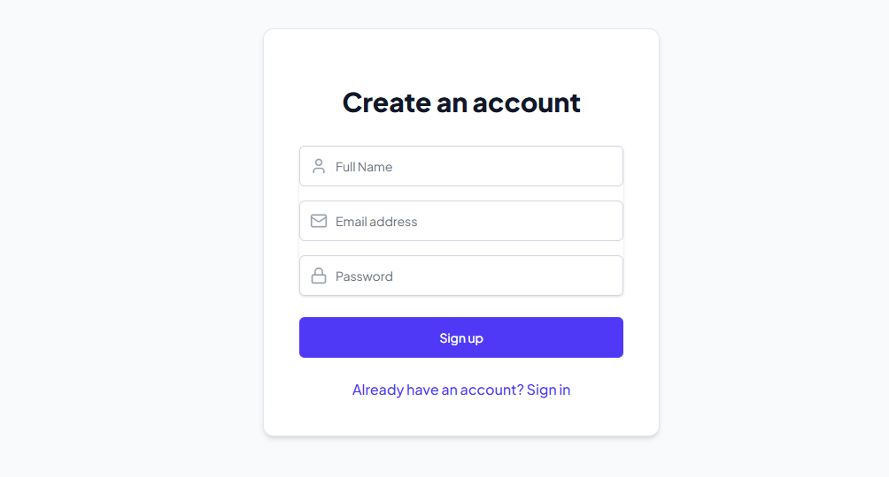
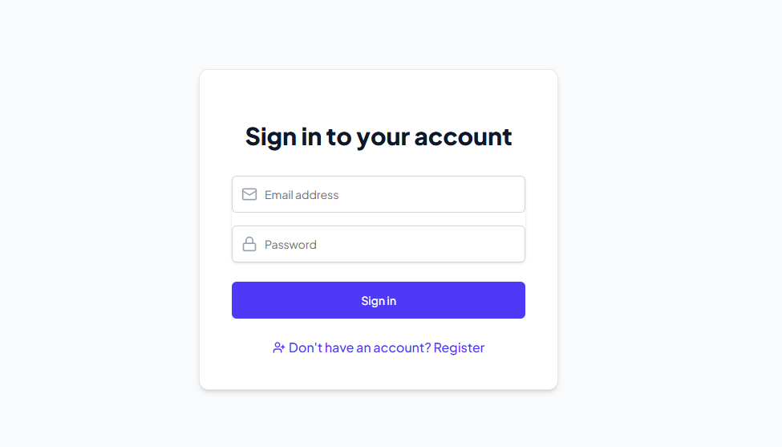
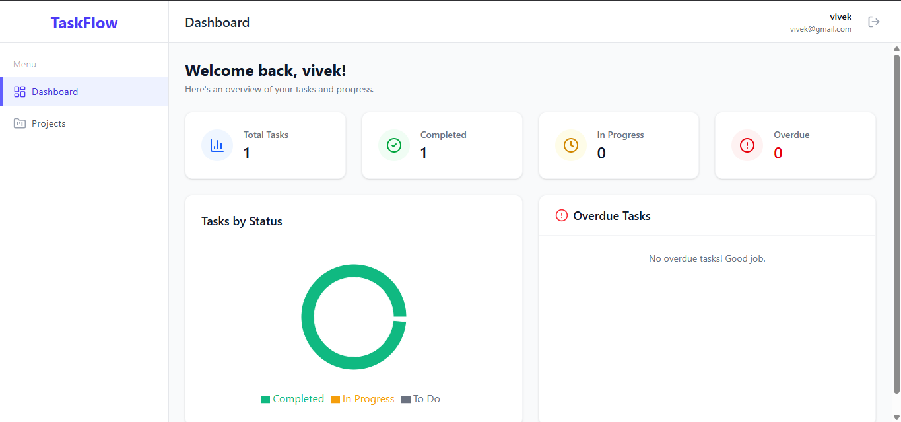
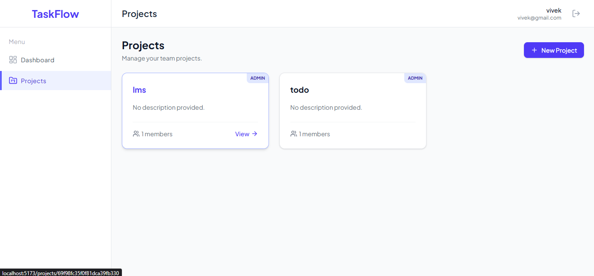
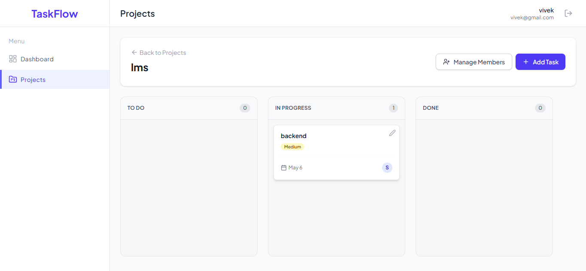
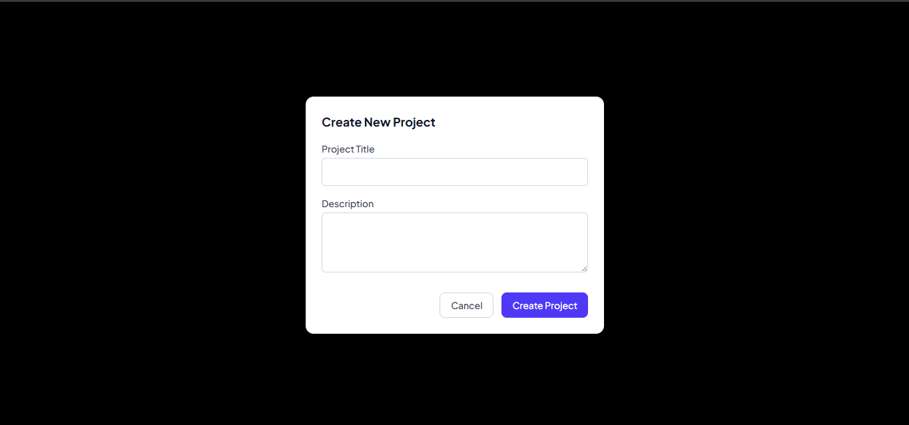
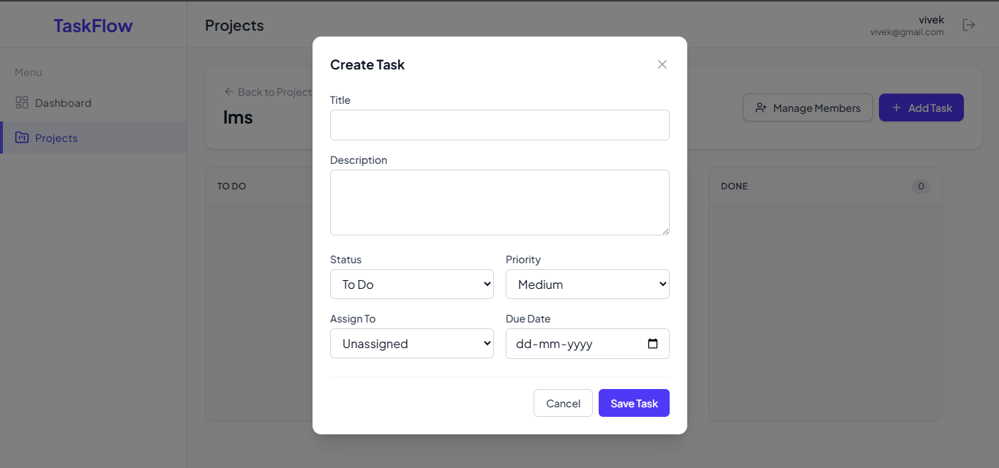
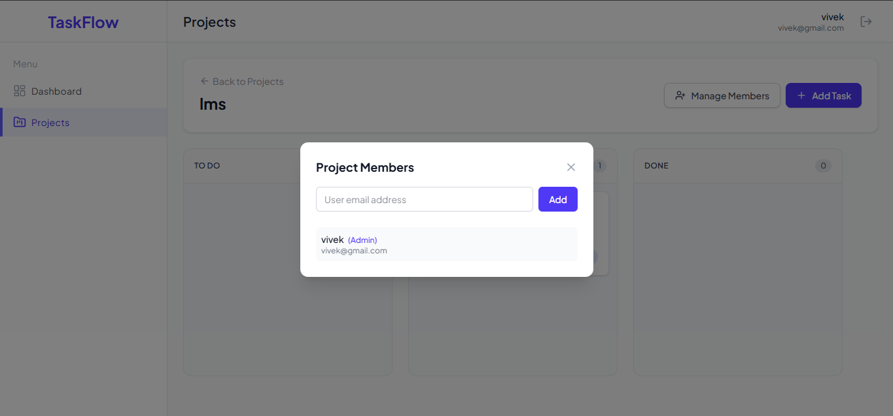

# Team Task Manager

A complete full-stack web application designed for teams to manage projects, assign tasks, and track progress with per-project role-based access control. Built with the MERN stack (MongoDB, Express, React, Node.js) and Tailwind CSS.

## Features
- **Authentication**: Secure Signup and Login using JWT and bcrypt.
- **Per-Project Role-Based Access Control**:
  - **Admin**: The creator of a project is its Admin. They can add/remove members by email, create tasks, assign tasks to members, edit all task details, and delete tasks.
  - **Member**: Added by the Admin. Can only view tasks and update task statuses (To Do / In Progress / Done) for tasks in projects they belong to.
- **Dashboard**: High-level overview with summary cards, a **Recharts** Pie Chart for task statuses, and a list of overdue tasks.
- **Kanban Task Board**: Visual management of tasks across 'To Do', 'In Progress', and 'Done' columns inside each project view.
- **Task Management**: Tasks feature Priorities (Low, Medium, High), Due Dates, and Assignees.

## Tech Stack
- **Frontend**: React.js, Vite, Tailwind CSS, React Router, Axios, Recharts, Lucide React (Icons).
- **Backend**: Node.js, Express.js, MongoDB (Mongoose ODM), JSON Web Tokens (JWT), BcryptJS.

## Local Setup Instructions

### Prerequisites
- Node.js installed
- MongoDB installed locally OR a MongoDB Atlas connection string

### 1. Clone & Install dependencies
Open a terminal and navigate to the project directory.

#### Backend (Server) Setup
```bash
cd server
npm install
```

#### Frontend (Client) Setup
```bash
cd client
npm install
```

### 2. Environment Variables
In the `server` folder, create a `.env` file with the following variables:

```env
PORT=5000
MONGO_URI=mongodb://localhost:27017/taskmanager
JWT_SECRET=your_super_secret_jwt_key
CLIENT_URL=http://localhost:5173
```
*(Note: If your Vite client runs on port 3000, update CLIENT_URL to `http://localhost:3000`)*

### 3. Run the Application

#### Run Backend
```bash
cd server
npm run dev
```
The server will start on `http://localhost:5000`.

#### Run Frontend
```bash
cd client
npm run dev
```
The frontend will start on your configured Vite port (usually `http://localhost:5173`).

## Screenshots










